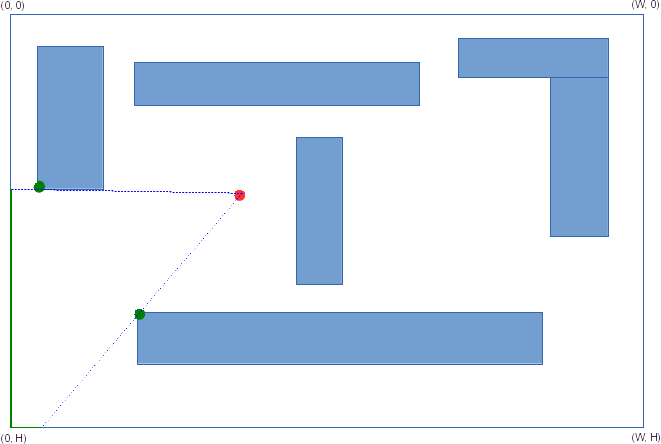

## 2. Видимость горизонта [+20]

Во входном CSV-файле задана схема размещения N домов и положение наблюдателя на плоскости в виде набора декартовых координат и размерностей:

```
planeWidth, planeHeight
observerX, observerY
house1_X, house1_Y, house1_W, house1_H
house2_X, house2_Y, house2_W, house2_H
…
houseN_X, houseN_Y, houseN_W, houseN_H
```

В первой строке задается размерность области. Во второй строке задается положение наблюдателя. Оставшиеся строчки описывают расположение и размеры прямоугольников, изображающих на схеме дома.

Для простоты считаем, что стены домов всегда параллельны осям координат.

Точка отсчета координатной сетки располагается в левом верхнем углу, координаты всегда положительны (см. схему на рисунке). 


Необходимо разработать алгоритм для вычисления всех существующих секторов свободного (т. е. не перекрытого стенами домов) обзора наблюдателя.  Решение формулируется в виде набора пар координат точек — углов прямоугольников (домов), ограничивающих обзор. Или в виде списка пар углов на эти точки (альтернативный вариант).

* При нахождении нескольких точек на одной линии обзора в результат должна попасть самая дальняя.
* Если ваше решение использует raycasting, угловой точности в 1 градус должно быть достаточно для оптимального результата.

----

