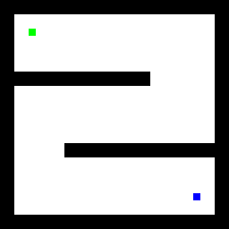
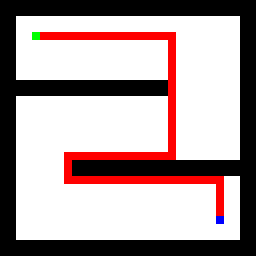
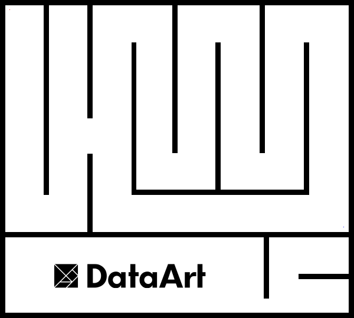

## 4. Проход Лабиринта [+20]
 
Нарисовать линию прохода по заданной картинке.
 
Начальная точка отмечена на картинке зеленым пикселом (#00FF00), а конечная позиция - синим (#0000FF):
 

 
Все белые пикселы можно считать свободными.  Все черные пикселы - стены, через которые пройти нельзя.
 
Решение должно представлять собой исходную картинку с путём обхода, нарисованном красной линией (#FF0000) шириной в один пиксел.

_(Возможное решение для приложенного выше примера.)_

И должно работать для более сложных лабиринтов:
 

 
----
