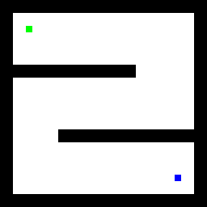
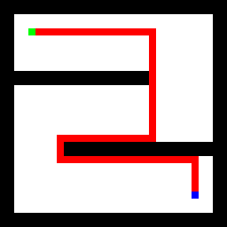

# IT-Планета 2021 — DataArt

## Предисловие
 
К решению предлагаются 4 задачи. У каждой — несколько шагов сложности, за каждый дополнительный шаг решения выдаются дополнительные баллы.
 
Решить все задачи с максимальной сложностью за 8 часов практически невозможно, тщательно выбирайте, какие задачи планируете решить, чтобы набрать максимальное количество баллов.
 
Поскольку все задачи имеют фиксированные данные на входе, есть соблазн формально в качестве решения предложить код, в котором будет жестко прописан результат. Такие решения приниматься не будут.
 
----

## 1. Калькулятор с четырьмя действиями [+20]
 
Входные данные содержат список выражений, разделенных переводом строк.
 
Каждое выражение состоит из чисел, разделенных операциями сложения (+),
вычитания (-), умножения (*) и деления (/).
 
Необходимо вычислить все выражения. Результаты разделить переводами строк.
 
Данные нужно читать со стандартного входа или из файла, переданного в качестве первого аргумента. Результат выдавать на стандартный выход или в файл, переданный в качестве второго аргумента.
 
Каждая строка, попадающая на вход, может быть выражением или же пустой строкой/комментарием.
 
Для чтения из ```./input/level-0.expr``` и записи результата в ```level-0.out``` необходимы следующие параметры:
 
```
./solution ./input/level-0.expr level-0.out
```
 
Если же запустить без параметров:
 
```
./solution
```
 
Чтение будет осуществляться с ```stdin```, а запись - в ```stdout```.
 
 
### Примеры работы
 
В примерах ниже префиксом ```>``` отмечены входные строки, а префиксом ```<``` - вывод калькулятора при работе в диалоговом режиме (stdin/stdout):
 
```
> 2 + 3
< 5
> 2 * 5 + 4
< 14
> 15/3
< 5
```
 
Если на вход передать следующий файл:
```
7 + 3
25 - 14
 
4 * 5
```
 
Результирующий файл будет:
 
```
10
11
20
```
 
 
### Бонусные задачи
 
Попробуйте реализовать для калькулятора следующие бонусные фичи:
 
* Операции в скобках выполняются перед операциями вне скобок
```
> 10 - (2 + 3)
< 5
```
 
* Пустые строки и строки, начинающиеся с #, игнорируются
* У операций умножения и деления приоритет выше, чем у сложения и вычитания
```
> 15 - 2 * 5
< 5
```
* Поддержка чисел с плавающей точкой в формате N.F (т. е. "3.1415")
* Поддержка негативных чисел в формате -N (т.е. "-5")
* Выводить сообщение о синтаксической ошибки в случае неправильной последовательности операторов (2 + + 3)
* Выводить сообщение о синтаксической ошибке в случае незакрытой скобки
 
----

## 2. Видимость горизонта [+20]

Во входном CSV-файле задана схема размещения N домов и положение наблюдателя на плоскости в виде набора декартовых координат и размерностей:

```
planeWidth, planeHeight
observerX, observerY
house1_X, house1_Y, house1_W, house1_H
house2_X, house2_Y, house2_W, house2_H
…
houseN_X, houseN_Y, houseN_W, houseN_H
```

В первой строке задается размерность области. Во второй строке задается положение наблюдателя. Оставшиеся строчки описывают расположение и размеры прямоугольников, изображающих на схеме дома.

Для простоты считаем, что стены домов всегда параллельны осям координат.

Точка отсчета координатной сетки располагается в левом верхнем углу, координаты всегда положительны (см. схему на рисунке). 


Необходимо разработать алгоритм для вычисления всех существующих секторов свободного (т. е. не перекрытого стенами домов) обзора наблюдателя.  Решение формулируется в виде набора пар координат точек — углов прямоугольников (домов), ограничивающих обзор. Или в виде списка пар углов на эти точки (альтернативный вариант).

* При нахождении нескольких точек на одной линии обзора в результат должна попасть самая дальняя.
* Если ваше решение использует raycasting, угловой точности в 1 градус должно быть достаточно для оптимального результата.

----

## 3. Перепаковка zip [+30]
 
Находящиеся в папке /input *.zip-файлы содержат данные о телефонных номерах и соответствующих e-mail адресах:
 
```
+1 (123) 3245-345-345 abc@domain.com, def@domain1.org
```
 
Один номер может соответствовать нескольким адресам e-mail.  В исходных данных могут быть дубликаты и пустые строки.
 
E-mail адреса, расположенные на одной строке, могут быть разделены пробелами, символами табуляции и запятыми.
 
Папки в архиве могут содержать и файлы с данными, и другие папки и архивы.  Некоторые файлы сжаты с помощью gzip-архиватора, поэтому имеют расширение .gz, другие архивы — стандартные .zip.
 
Необходимо распаковать и разобрать архив, выполнив следующие действия:
 
1. В рабочем каталоге сгенерировать файл ```phones.txt```, в котором разместить все уникальные телефонные номера в формате ```+1 (101) 678901234```, отсортированные в алфавитном порядке.
 
2. Коды городов во всех номерах телефонов из файла phones.txt должны быть изменены согласно таблице:
 
```
a. 101 → 401.
b. 202 → 802.
c. 301 → 321.
```
 
3. В рабочем каталоге сгенерировать файл ```emails.txt```, содержащий список всех уникальных e-mail-адресов из .org домена, отсортированных в алфавитном порядке.
 
4. (Бонус) Сгенерировать архив, содержащий все данные исходного архива, и файлы phones.txt и emails.txt, размещенные в корне.
 
 
**Внимание!!!***
Для решения задачи необходимо строго следовать следующим правилам разбора исходных данных:
* Если в исходной строке присутствует @, значит, скорее всего мы имеем дело с телефоном и соответствующими e-mail-адресами.
* Каждое число, предшествующее началу первого e-mail-адреса, является частью телефона:
 
```
+15 (101) 15 1515 something@...
```
 
* Телефонный номер состоит из опционального ```+``` в начале, чисел и одной пары скобок с числами внутри.
* Числа в скобках — коды городов (их и нужно заменить, согласно таблице выше).
* Уберите все пробелы из телефонных номеров.
* Уберите все лишние символы перед и после телефонного номера (между номером и e-mail).
* E-mail адреса разделены пробелами, символами табуляции, запятыми и двоеточиями.
* Решение с регулярными выражениями может оказаться слишком сложным, поэтому постарайтесь разбирать исходные данные вручную, без использования RegExp.
 
----
 
## 4. Проход Лабиринта [+20]
 
Нарисовать линию прохода по заданной картинке.
 
Начальная точка отмечена на картинке зеленым пикселом (#00FF00), а конечная позиция - синим (#0000FF):
 

 
Все белые пикселы можно считать свободными.  Все черные пикселы - стены, через которые пройти нельзя.
 
Решение должно представлять собой исходную картинку с путём обхода, нарисованном красной линией (#FF0000) шириной в один пиксел.



_(Возможное решение для приложенного выше примера.)_

И должно работать для более сложных лабиринтов:
 

 
----

---- 

## Полезные советы
 
* Мы намеренно включили объемные и разнообразные задачи с разными градациями решения. Вначале выбирайте задачу, решение которой вам кажется самым простым. Для разных людей это будут разные задачи. Решать по порядку может быть не самой лучшей идеей: можно застрять на какой-то одной задаче, потратив на ее решение слишком много времени.
* Для удобства предлагаем использовать для запуска и тестирования скрипты (bash/bat).
* Некоторые решения могут использовать библиотеки, не входящие в базовую поставку вашей платформы. В таком случае в папке решения добавьте скрипт (install.sh/install.bat), устанавливающий нужные зависимости (к примеру, там может быть запуск "npm install" для Node.js или "pip install ..." для Python).
* Учитывайте, что результирующий архив при выгрузке не должен превышать 50mb. Убедитесь, что вы не запаковываете в архив слишком большие артефакты сборки и зависимости. К примеру (для Node.js), удалите ```node_modules```, чтобы облегчить результирующий архив.

